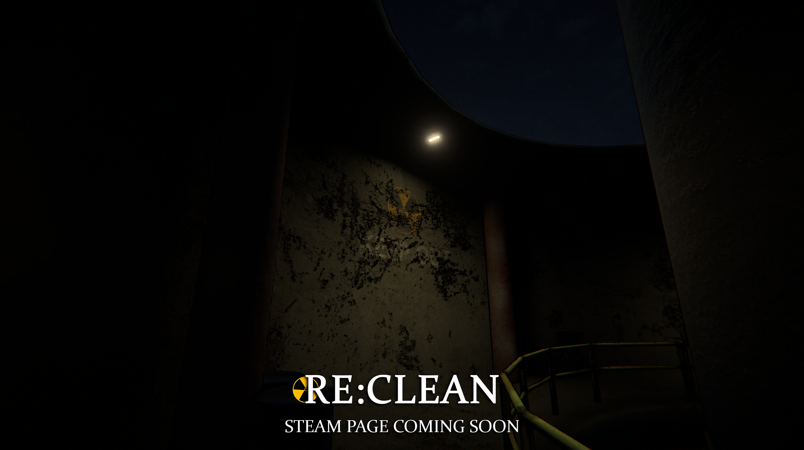

<h1 align="center">ghostbusterbob</h1>

<h3 align="center">☢️ In Development: RE:CLEAN</h3> 

Steam page coming soon.

  <!-- Large top image -->
  

  <!-- Two smaller images side-by-side -->
  

    
    
  

  

&nbsp;

   
   
  
  <a href="https://www.blender.org/" target="_blank" rel="noreferrer"> 

###

  

###

  
  

###
